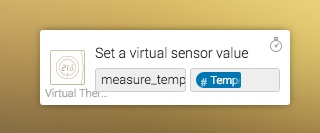
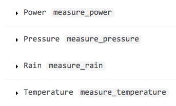

# Virtual Devices

* [Description](index)
* [Sensors](sensor)
* [Modes](mode)
* [Versions](version)
* [Questions](https://community.athom.com/t/virtual-devices/1723)
* [Bugs, Issues, and Feature Requests](https://github.com/ArjanKranenburg/virtual-devices/issues)

## Sensor

A Virtual Sensor is a bit contradictory, but nevertheless users wanted to view a value in a device, e.g. the actual room temperature in a Thermostat.

### How to add a Sensor

Simply add one of the sensor-capabilities to a Virtual Device.

### How to set the sensor's value

The value of a sensor can be set with an action-card in a flow.

1. Add the card entitled 'Set a virtual sensor value' in the Then-column of a flow.
2. Set the technical name (see below) of the sensor-capability in the first field.
3. Set the value in the second field. This can also be a tag from another device or card.

### What are the technical names of the sensor capabilities

The technical name to fill in step 2 above is the capability name as shown on
[Athom's capability reference](https://developer.athom.com/docs/apps/tutorial-Drivers-Reference.html).

It is the name in the grey-box, e.g. measure_temperature.

